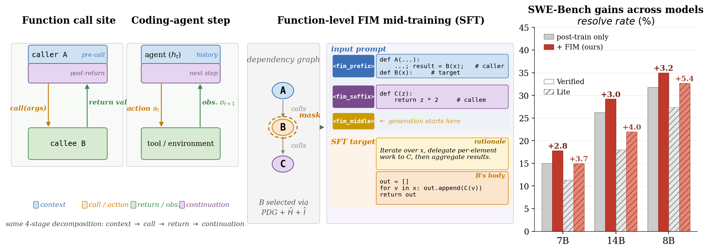
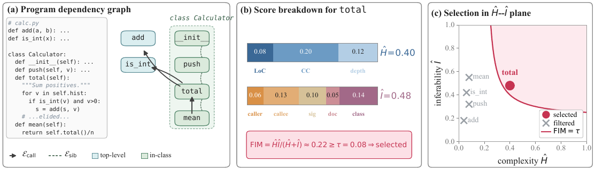

<h1 align="center">Function-Aware Fill-in-the-Middle as Mid-Training<br>for Coding Agent Foundation Models</h1>

<p align="center">
  <a href="paper.pdf"></a>
  <!-- TODO once arXiv is live: <a href="https://arxiv.org/abs/XXXX.XXXXX"></a> -->
  <a href="https://huggingface.co/collections/TIGER-Lab/fim-midtraining"></a>
  <a href="https://huggingface.co/datasets/TIGER-Lab/FIM-Midtraining-400K"></a>
  <a href="LICENSE"></a>
</p>

<p align="center">
  
</p>

A coding agent's inner loop — **act → observe → continue** — is structurally the same shape as a function call site: a caller binds arguments, a callee returns a value computed elsewhere, and downstream code consumes that value. That conditioning structure already exists, at internet scale, in ordinary code.

This project exploits it. We mask *functions* — chosen by program-dependency-graph analysis and a complexity–inferability double criterion, not at random — and mid-train on recovering them, rationale first. Then we hand the checkpoint to an existing agentic post-training pipeline, **unmodified**. The gain survives post-training, transfers across post-training pipelines (R2E-Gym, SWE-Smith, SWE-Lego) and base families (Qwen2.5-Coder, Qwen3), and pays back most of the general-capability erosion that agentic post-training quietly charges.

## 🔥 News

- **[2026-07]** Full release: [corpus (400K samples / 2.6B tokens)](https://huggingface.co/datasets/TIGER-Lab/FIM-Midtraining-400K), [six checkpoints](https://huggingface.co/collections/TIGER-Lab/fim-midtraining), data-construction pipeline, training configs, and evaluation guides.
- **[2026-07]** Paper submitted to arXiv — link coming shortly; a copy ships in this repo as [`paper.pdf`](paper.pdf).

## 📦 Released artifacts

**Models** — every arm of the paper's pipeline, on the Hub:

| Model | Base | Recipe | SWE-Bench-Verified | SWE-Bench-Lite |
|---|---|---|---|---|
| [FIM-Mid-7B](https://huggingface.co/TIGER-Lab/FIM-Mid-7B) | Qwen2.5-Coder-7B-Instruct | FIM mid-training only | — | — |
| [FIM-Mid-8B](https://huggingface.co/TIGER-Lab/FIM-Mid-8B) | Qwen3-8B | FIM mid-training only | — | — |
| [FIM-Mid-14B](https://huggingface.co/TIGER-Lab/FIM-Mid-14B) | Qwen2.5-Coder-14B-Instruct | FIM mid-training only | — | — |
| [**FIM-7B**](https://huggingface.co/TIGER-Lab/FIM-7B) | FIM-Mid-7B | + R2E-Gym post-training | **17.80** (+2.8) | **15.00** (+3.7) |
| [**FIM-8B**](https://huggingface.co/TIGER-Lab/FIM-8B) | FIM-Mid-8B | + SWE-Lego post-training | **35.00** (+3.2) | **32.70** (+5.4) |
| [**FIM-14B**](https://huggingface.co/TIGER-Lab/FIM-14B) | FIM-Mid-14B | + R2E-Gym post-training | **29.20** (+3.0) | **22.00** (+4.0) |

The `FIM-Mid-*` checkpoints are released for reproducibility and further post-training — the paper deliberately never scores them directly (a FIM-only model has degraded instruction-following and cannot be compared fairly against instruction-tuned baselines).

**Dataset** — [TIGER-Lab/FIM-Midtraining-400K](https://huggingface.co/datasets/TIGER-Lab/FIM-Midtraining-400K):

| Config | Samples | Masked target | Tokens |
|---|---|---|---|
| `all_merged` (main-results corpus) | 400,000 | 80% single / 15% pair / 5% triple | ~2.63B |
| `single_function` | 320,000 | one function body | ~2.0B |
| `function_pair` | 60,000 | two coupled functions, jointly | ~0.4B |
| `function_triple` | 20,000 | three coupled functions, jointly | ~0.2B |

Built from 968 permissively-licensed Python repositories, zero overlap with SWE-Bench source repos, commit-date cutoff before the earliest SWE-Bench base commit, every sample carrying a filtered Gemini-3-Flash rationale and full provenance metadata.

## 📊 Results

**In-domain (Table 1).** Means over three evaluation seeds; *baseline* is base + post-training reproduced under our harness, *ours* adds FIM mid-training in front of the identical pipeline.

| Setting | SWE-Bench-Verified | SWE-Bench-Lite | Average |
|---|---|---|---|
| ***Qwen2.5-Coder-7B-Instruct*** | | | |
| &nbsp;&nbsp;+ R2E-Gym (reproduced) | 15.00 | 11.33 | 13.17 |
| &nbsp;&nbsp;+ R2E-Gym (officially reported) | 19.00 | 11.00 | 15.00 |
| &nbsp;&nbsp;**+ FIM-Midtrain + R2E-Gym** → [FIM-7B](https://huggingface.co/TIGER-Lab/FIM-7B) | **17.80** | **15.00** | **16.40** |
| &nbsp;&nbsp;Δ (ours vs. reproduced) | +2.80 | +3.67 | +3.24 |
| &nbsp;&nbsp;+ SWE-Smith (reproduced) | 12.30 | 14.20 | 13.25 |
| &nbsp;&nbsp;**+ FIM-Midtrain + SWE-Smith** | **17.60** | **14.70** | **16.15** |
| &nbsp;&nbsp;Δ (ours vs. reproduced) | +5.30 | +0.50 | +2.90 |
| ***Qwen2.5-Coder-14B-Instruct*** | | | |
| &nbsp;&nbsp;+ R2E-Gym (reproduced) | 26.20 | 18.00 | 22.10 |
| &nbsp;&nbsp;**+ FIM-Midtrain + R2E-Gym** → [FIM-14B](https://huggingface.co/TIGER-Lab/FIM-14B) | **29.20** | **22.00** | **25.60** |
| &nbsp;&nbsp;Δ (ours vs. reproduced) | +3.00 | +4.00 | +3.50 |
| ***Qwen3-8B*** | | | |
| &nbsp;&nbsp;+ SWE-Lego (reproduced) | 31.80 | 27.30 | 29.55 |
| &nbsp;&nbsp;**+ FIM-Midtrain + SWE-Lego** → [FIM-8B](https://huggingface.co/TIGER-Lab/FIM-8B) | **35.00** | **32.70** | **33.85** |
| &nbsp;&nbsp;Δ (ours vs. reproduced) | +3.20 | +5.40 | +4.30 |

**Capability preservation (Table 2, 14B + R2E-Gym).** Agentic post-training buys SWE-Bench points and quietly charges for them elsewhere — 4.81 points on average across six benchmarks. Mid-training pays most of that bill back *in the same run*:

| Setting | LiveCode | OJBench | FSB-EN | Terminal | τ-bench | BFCL | Avg |
|---|---|---|---|---|---|---|---|
| Instruct model (ceiling) | 37.20 | 5.20 | 53.80 | 0.00 | 5.70 | 23.20 | 20.85 |
| + R2E-Gym | 24.10 | 2.80 | 47.72 | 2.41 | 3.40 | 15.80 | 16.04 |
| **+ FIM Mid-Train + R2E-Gym** | **35.20** | **4.74** | **48.25** | **3.66** | **7.30** | **18.20** | **19.56** |
| Δ (vs. R2E-Gym only) | +11.10 | +1.94 | +0.53 | +1.25 | +3.90 | +2.40 | +3.52 |

The load-bearing cells are **τ-bench (+3.9) and BFCL (+2.4)**: neither contains Python code-editing data, and the corpus contains no tool-use trajectories. There is no data overlap that could explain those gains — only a structural prior installed at mid-training that outlives post-training.

## 🔍 How targets are selected

<p align="center">
  
</p>

Not every function is worth masking. For each file we parse the AST into a program dependency graph (call edges + same-class sibling edges), score every function on **complexity Ĥ** (LoC, cyclomatic complexity, nesting) and **inferability Î** (call-site specificity, in-file callees, signature, docstring, class context), and keep targets where `FIM = Ĥ·Î/(Ĥ+Î)·ρ(Δ)` clears a threshold — substantial *and* recoverable, with a one-sided penalty on targets that stay hard even given full context. Groups of 2–3 coupled functions are selected over eight dependency topologies with inferability recomputed under joint masking. Each target then gets a rationale generated from the masked context only, judged against the ground truth, and formatted rationale-before-body — the think-then-act structure of an agent step.

## 🚀 Quickstart

**Just use a model** (FIM-8B is the strongest released checkpoint):

```bash
vllm serve TIGER-Lab/FIM-8B --served-model-name FIM-8B --max-model-len 163840
```

Scoring it on SWE-Bench, with the scaffold each checkpoint was post-trained for: [`evaluation/swebench/released_checkpoints.md`](evaluation/swebench/released_checkpoints.md).

**Reproduce the paper**, stage by stage:

```bash
# 0. (optional) Rebuild the corpus from scratch — or skip: it is on the Hub
cd data_construction && pip install -r requirements.txt
export GEMINI_API_KEY='...'
./scripts/run_all.sh single          # start with 2 repos, a few cents of API spend

# 1. Mid-train (8x H100, LLaMA-Factory)          -> midtraining/
huggingface-cli download TIGER-Lab/FIM-Midtraining-400K all_merged_400k.jsonl \
  --repo-type dataset --local-dir <LLaMA-Factory>/data/
llamafactory-cli train midtraining/configs/fim_midtrain.yaml

# 2. Post-train twice: from the stock model, and from the mid-trained one
#    R2E-Gym | SWE-Smith | SWE-Lego, upstream recipes unmodified   -> posttraining/

# 3. Evaluate both arms through the identical harness              -> evaluation/
```

Every stage is run **twice** — once from the stock instruct model (baseline), once from the mid-trained checkpoint (ours). The difference between those two runs is the entire claim. Both arms must go through an identical post-training and evaluation harness; comparing against a *published* baseline instead of your own reproduction is how a harness difference gets reported as a method gain.

## 🗂️ Repository layout

```
data_construction/   968 GitHub repos -> 400K FIM samples (~2.6B tokens)
        |            PDG parsing, Ĥ/Î scoring, masking, CoT generation + filtering
midtraining/         base model + FIM corpus -> FIM-Mid-{7B,8B,14B}
        |            one reference config + the three as-run configs
posttraining/        + R2E-Gym | SWE-Smith | SWE-Lego  -> FIM-{7B,8B,14B}
        |            upstream recipes, unmodified; reference + as-run configs
evaluation/          SWE-Bench Verified/Lite (scripts) + six capability
                     benchmarks (pinned repro guides)
```

| Stage | What's there |
|---|---|
| [`data_construction/`](data_construction) | Complete and tested — builds the corpus end to end from a repo list |
| [`midtraining/`](midtraining) | LLaMA-Factory configs; identical recipe for all three base models |
| [`posttraining/`](posttraining) | One directory per pipeline (R2E-Gym, SWE-Smith, SWE-Lego) |
| [`evaluation/`](evaluation) | SWE-Bench scripts + exact repro guides for the six Table-2 benchmarks |

## 💻 Compute

Everything ran on a **single node of 8x H100 80GB**. Mid-training is 1 epoch at 32K context. SWE-Bench evaluation is by far the slowest step: hundreds of Docker containers per pass, and the paper averages three seeds per arm per split. The full paper is ~5,760 GPU-hours.

## 📜 Corpus licensing

The 968 source repositories are each under their own license (>80% MIT/Apache/BSD; all at least research-permissive). The per-repository inventory ships in [`data_construction/data/code_repo_list_968.csv`](data_construction/data/code_repo_list_968.csv) and joins to every released sample via its `repository_url` metadata. **Check it against your intended use before training on anything derived from this corpus.** Code in this repository is Apache-2.0.

## 📖 Citation

```bibtex
@article{wang2026fim,
  title={Function-Aware Fill-in-the-Middle as Mid-Training for Coding Agent Foundation Models},
  author={Wang, Yubo and Liang, Jiarong and Zhang, Yuxuan and Liu, Xuye and Wei, Cong and Zhang, Yuyu and Nie, Ping and Chen, Wenhu},
  journal={arXiv preprint},
  year={2026}
}
```

## 🙏 Acknowledgements

The post-training pipelines and agent scaffolds are used as released by their authors — [R2E-Gym](https://github.com/R2E-Gym/R2E-Gym), [SWE-Smith](https://github.com/SWE-bench/SWE-smith), [SWE-Lego](https://huggingface.co/SWE-Lego), [OpenHands](https://github.com/All-Hands-AI/OpenHands), and [SWE-bench](https://github.com/princeton-nlp/SWE-bench) for scoring. Training uses [LLaMA-Factory](https://github.com/hiyouga/LLaMA-Factory) and [torchtune](https://github.com/pytorch/torchtune); base models are [Qwen2.5-Coder](https://huggingface.co/Qwen/Qwen2.5-Coder-7B-Instruct) and [Qwen3](https://huggingface.co/Qwen/Qwen3-8B); rationales come from Gemini-3-Flash.
